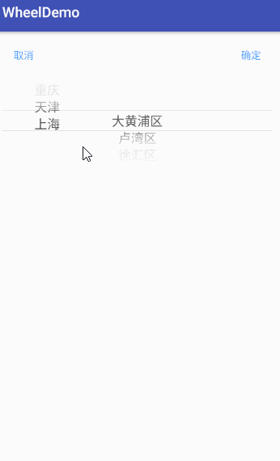
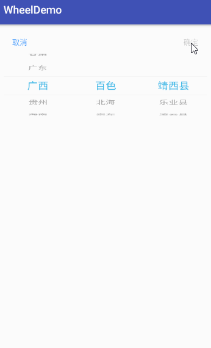
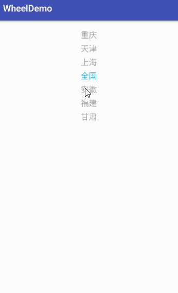
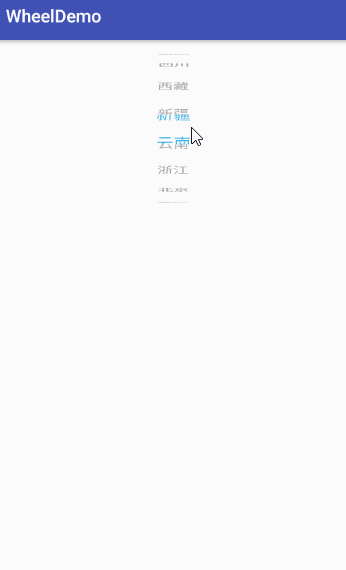

# WheelDemo
用[wheel](https://code.google.com/archive/p/android-wheel/)和[androidWheelView](https://github.com/weidongjian/androidWheelView)库为基础的1至3级联动, 支持ios滚轮模式  
## thanks ##
[wheel](https://code.google.com/archive/p/android-wheel/)  
[androidWheelView](https://github.com/weidongjian/androidWheelView)  

## 效果图 ##
</img> </img>  
  

</img> </img>
## 使用 ##
### CharacterPickerView ###
xml 
    
        <com.wang.wheel.widget.CharacterPickerView
           android:id="@+id/picker_view"
           android:layout_width="match_parent"
           android:layout_height="wrap_content"
           android:layout_margin="16dp"
           android:background="@android:color/white"
           app:cp_drawShadows="true"
           app:cp_listCount="3"
           app:cp_visibleItems="5">
        </com.wang.wheel.widget.CharacterPickerView>  
<table>
<thead>
<tr>
<th align="center">name</th>
<th align="center">format</th>
<th align="center">description</th>
</tr>
</thead>
<tbody>

<tr>
<td align="left">cp_drawShadows</td>
<td align="center">boolean</td>
<td align="center">是否绘制覆盖在表层的阴影</td>
</tr>

<tr>
<td align="left">cp_shadowsColorStart</td>
<td align="center">color</td>
<td align="center">阴影渐变色的开始</td>
</tr>

<tr>
<td align="left">cp_shadowsColorCenter</td>
<td align="center">color</td>
<td align="center">阴影渐变色的中间</td>
</tr>

<tr>
<td align="left">cp_shadowsColorEnd</td>
<td align="center">color</td>
<td align="center">阴影渐变色的结束</td>
</tr>

<tr>
<td align="left">cp_wheelBackground</td>
<td align="center">reference</td>
<td align="center">wheelView背景</td>
</tr>

<tr>
<td align="left">cp_dividerColor</td>
<td align="center">color</td>
<td align="center">中间分割线的颜色</td>
</tr>

<tr>
<td align="left">cp_dividerEnable</td>
<td align="center">boolean</td>
<td align="center">是否绘制中间的分割线</td>
</tr>

<tr>
<td align="left">cp_textColorUnselected</td>
<td align="center">color</td>
<td align="center">未选中的文字颜色</td>
</tr>

<tr>
<td align="left">cp_textColorSelected</td>
<td align="center">color</td>
<td align="center">选中的文字颜色</td>
</tr>

<tr>
<td align="left">cp_textSize</td>
<td align="center">dimension</td>
<td align="center">文字大小</td>
</tr>

<tr>
<td align="left">cp_cancelTextColor</td>
<td align="center">color</td>
<td align="center">取消按键的文字颜色</td>
</tr>

<tr>
<td align="left">cp_cancelText</td>
<td align="center">string</td>
<td align="center">取消按键的显示文字</td>
</tr>

<tr>
<td align="left">cp_confirmTextColor</td>
<td align="center">color</td>
<td align="center">确定按键的文字颜色</td>
</tr>

<tr>
<td align="left">cp_confirmText</td>
<td align="center">string</td>
<td align="center">确定按键的显示文字</td>
</tr>

<tr>
<td align="left">cp_cycle</td>
<td align="center">boolean</td>
<td align="center">是否循环</td>
</tr>

<tr>
<td align="left">cp_listCount</td>
<td align="center">integer</td>
<td align="center">几级联动 最多支持3级</td>
</tr>

<tr>
<td align="left">cp_visibleItems</td>
<td align="center">integer</td>
<td align="center">显示个数</td>
</tr>

</tbody>
</table>
java  

        CharacterPickerView pickerView = (CharacterPickerView) findViewById(R.id.picker_view);
        pickerView.setDefault(20, 0, 0);
        pickerView.setAllData(mLocations);
        pickerView.setButtonClickListener(new OnButtonClickListener() {

            @Override
            public void onClick(DataModel province, DataModel city, DataModel area) {
                   Toast.makeText(MultiPickActivity.this, province.Name + " " + city.Name + " " + area.Name, Toast.LENGTH_SHORT).show();
            }

            @Override
            public void onCancel() {
                  Toast.makeText(MultiPickActivity.this, "cancel", Toast.LENGTH_SHORT).show();
               }
            });

### IOSCharacterPickerView ###
xml  

        <com.wang.wheel.widget.IOSCharacterPickerView
           android:id="@+id/picker_view"
           android:layout_width="match_parent"
           android:layout_height="wrap_content"
           android:layout_margin="16dp"
           android:background="@android:color/white"
           app:icp_listCount="3"
           app:icp_textColorSelected="@android:color/holo_blue_light"
           app:icp_visibleItems="5"
           app:icp_wheelBackground="@android:color/white">
       </com.wang.wheel.widget.IOSCharacterPickerView>
<table>
<thead>
<tr>
<th align="center">name</th>
<th align="center">format</th>
<th align="center">description</th>
</tr>
</thead>
<tbody>

<tr>
<td align="left">icp_gravity</td>
<td align="center">enum</td>
<td align="center">文字位置</td>
</tr>

<tr>
<td align="left">icp_wheelBackground</td>
<td align="center">reference</td>
<td align="center">wheelView背景</td>
</tr>

<tr>
<td align="left">icp_dividerColor</td>
<td align="center">color</td>
<td align="center">中间分割线的颜色</td>
</tr>

<tr>
<td align="left">icp_dividerEnable</td>
<td align="center">boolean</td>
<td align="center">是否绘制中间的分割线</td>
</tr>

<tr>
<td align="left">icp_textColorUnselected</td>
<td align="center">color</td>
<td align="center">未选中的文字颜色</td>
</tr>

<tr>
<td align="left">icp_textColorSelected</td>
<td align="center">color</td>
<td align="center">选中的文字颜色</td>
</tr>

<tr>
<td align="left">icp_textSize</td>
<td align="center">dimension</td>
<td align="center">文字大小</td>
</tr>

<tr>
<td align="left">icp_cancelTextColor</td>
<td align="center">color</td>
<td align="center">取消按键的文字颜色</td>
</tr>

<tr>
<td align="left">icp_cancelText</td>
<td align="center">string</td>
<td align="center">取消按键的显示文字</td>
</tr>

<tr>
<td align="left">icp_confirmTextColor</td>
<td align="center">color</td>
<td align="center">确定按键的文字颜色</td>
</tr>

<tr>
<td align="left">icp_confirmText</td>
<td align="center">string</td>
<td align="center">确定按键的显示文字</td>
</tr>

<tr>
<td align="left">icp_cycle</td>
<td align="center">boolean</td>
<td align="center">是否循环</td>
</tr>

<tr>
<td align="left">icp_listCount</td>
<td align="center">integer</td>
<td align="center">几级联动 最多支持3级</td>
</tr>

<tr>
<td align="left">icp_visibleItems</td>
<td align="center">integer</td>
<td align="center">显示个数</td>
</tr>

</tbody>
</table>
java  

        IOSCharacterPickerView pickerView = (IOSCharacterPickerView) findViewById(R.id.picker_view);
        pickerView.setProvince(mProvinceDatas);
        pickerView.setCity(mCitisDatasMap);
        pickerView.setArea(mAreaDatasMap);
        pickerView.setButtonClickListener(new OnButtonClickListener() {
            @Override
            public void onClick(DataModel province, DataModel city, DataModel area) {
                Toast.makeText(IOSMultiPickActivity.this, province.Name + " " + city.Name + " " + area.Name, Toast.LENGTH_SHORT).show();
            }

            @Override
            public void onCancel() {
                Toast.makeText(IOSMultiPickActivity.this, "cancel", Toast.LENGTH_SHORT).show();
            }
        });
       }  

### WheelView ###
xml 
    
        <com.wang.wheel.widget.WheelView
           android:id="@+id/picker_view"
           android:layout_width="match_parent"
           android:layout_height="wrap_content"
           android:layout_margin="16dp"
           android:background="@android:color/white"
           app:wv_cycle="true"
           app:wv_visibleItems="7"
           app:wv_drawShadows="false"
           app:wv_dividerEnable="false"
           app:wv_textColorSelected="@android:color/holo_blue_light"/>
<table>
<thead>
<tr>
<th align="center">name</th>
<th align="center">format</th>
<th align="center">description</th>
</tr>
</thead>
<tbody>

<tr>
<td align="left">wv_drawShadows</td>
<td align="center">boolean</td>
<td align="center">是否绘制覆盖在表层的阴影</td>
</tr>

<tr>
<td align="left">wv_shadowsColorStart</td>
<td align="center">color</td>
<td align="center">阴影渐变色的开始</td>
</tr>

<tr>
<td align="left">wv_shadowsColorCenter</td>
<td align="center">color</td>
<td align="center">阴影渐变色的中间</td>
</tr>

<tr>
<td align="left">wv_shadowsColorEnd</td>
<td align="center">color</td>
<td align="center">阴影渐变色的结束</td>
</tr>

<tr>
<td align="left">wv_dividerColor</td>
<td align="center">color</td>
<td align="center">中间分割线的颜色</td>
</tr>

<tr>
<td align="left">wv_dividerEnable</td>
<td align="center">boolean</td>
<td align="center">是否绘制中间的分割线</td>
</tr>

<tr>
<td align="left">wv_textColorUnselected</td>
<td align="center">color</td>
<td align="center">未选中的文字颜色</td>
</tr>

<tr>
<td align="left">wv_textColorSelected</td>
<td align="center">color</td>
<td align="center">选中的文字颜色</td>
</tr>

<tr>
<td align="left">wv_textSize</td>
<td align="center">dimension</td>
<td align="center">文字大小</td>
</tr>

<tr>
<td align="left">wv_cycle</td>
<td align="center">boolean</td>
<td align="center">是否循环</td>
</tr>

<tr>
<td align="left">wv_visibleItems</td>
<td align="center">integer</td>
<td align="center">显示个数</td>
</tr>

</tbody>
</table>
java  

        WheelView wheelView = (WheelView) findViewById(R.id.picker_view);
        wheelView.setAdapter(new ArrayWheelAdapter<>(this, mProvinceDatas));  
### IOSWheelView ###
xml 
    
        <com.wang.wheel.widget.IOSWheelView
           android:layout_margin="16dp"
           android:background="@android:color/white"
           android:id="@+id/picker_view"
           android:layout_width="match_parent"
           android:layout_height="wrap_content"
           app:iwv_cycle="true"
           app:iwv_dividerEnable="false"
           app:iwv_textColorSelected="@android:color/holo_blue_light"
           app:iwv_visibleItems="7"/>
<table>
<thead>
<tr>
<th align="center">name</th>
<th align="center">format</th>
<th align="center">description</th>
</tr>
</thead>
<tbody>

<tr>
<td align="left">iwv_gravity</td>
<td align="center">enum</td>
<td align="center">文字的位置</td>
</tr>

<tr>
<td align="left">iwv_dividerColor</td>
<td align="center">color</td>
<td align="center">中间分割线的颜色</td>
</tr>

<tr>
<td align="left">iwv_dividerEnable</td>
<td align="center">boolean</td>
<td align="center">是否绘制中间的分割线</td>
</tr>

<tr>
<td align="left">iwv_textColorUnselected</td>
<td align="center">color</td>
<td align="center">未选中的文字颜色</td>
</tr>

<tr>
<td align="left">iwv_textColorSelected</td>
<td align="center">color</td>
<td align="center">选中的文字颜色</td>
</tr>

<tr>
<td align="left">iwv_textSize</td>
<td align="center">dimension</td>
<td align="center">文字大小</td>
</tr>

<tr>
<td align="left">iwv_cycle</td>
<td align="center">boolean</td>
<td align="center">是否循环</td>
</tr>

<tr>
<td align="left">iwv_visibleItems</td>
<td align="center">integer</td>
<td align="center">显示个数</td>
</tr>

</tbody>
</table>
java  

        IOSWheelView wheelView = (IOSWheelView) findViewById(R.id.picker_view);
        wheelView.setAdapter(new ArrayWheelAdapter<>(this, mProvinceDatas));